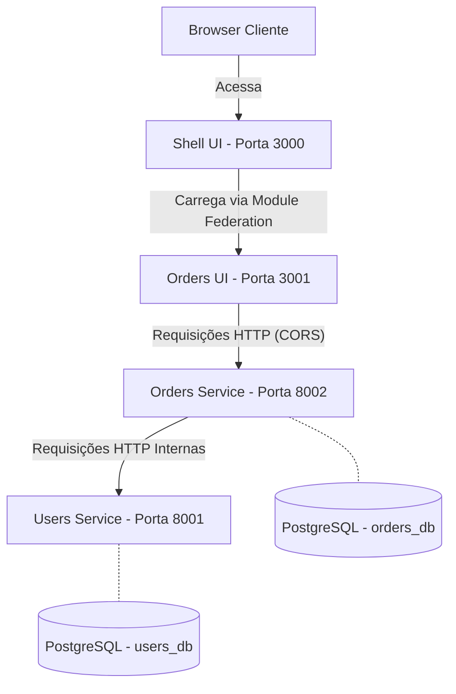

# E-Commerce Gestão de Pedidos (MVP)

Este é um projeto de MVP para a plataforma interna de gestão de pedidos de uma empresa de e-commerce, construído utilizando uma arquitetura de Microsserviços e Microfrontends.

## 🚀 Instruções de Execução

### Pré-requisitos
- Docker e Docker Compose instalados e em execução.
- Git.

### Passos
1. Clone o repositório.
2. Na raiz do projeto, suba toda a stack Docker:
   ```bash
   docker-compose up --build
   ```
3. Acesse a aplicação no seu navegador:
   - **Frontend (Shell com o MFE de Pedidos integrado)**: [http://localhost:3000](http://localhost:3000)
   - **MFE de Pedidos (Remoto Isolado)**: [http://localhost:3001](http://localhost:3001)
4. Acesse a documentação nativa das APIs (Swagger):
   - **Users Service**: [http://localhost:8001/docs](http://localhost:8001/docs)
   - **Orders Service**: [http://localhost:8002/docs](http://localhost:8002/docs)

*(Nota: Na primeira execução o banco de dados e as builds Node do Vite podem levar alguns minutos para ficarem prontas)*

## 🏗️ Arquitetura

O projeto foi construído utilizando:
- **Backend**: FastAPI para performance, concorrência nativa (async) e geração automática de documentação OpenAPI (Swagger).
- **Frontend**: React + Vite, configurados com `@originjs/vite-plugin-federation` para uso de Microfrontends fáceis e leves, usando SPAs modernas.
- **Banco de Dados**: PostgreSQL configurado com bases relacionais lógicas (`users_db` e `orders_db`) para garantir a persistência isolada por microsserviço.
- **Infraestrutura**: Docker Compose orquestrando Serviços de API, Frontends e Banco de Dados.

### Diagrama de Serviços



## 🧠 Decisões Técnicas
- **FastAPI vs Django REST**: A escolha foi pelo FastAPI por conta da flexibilidade para APIs modernas baseadas em async/await, pydantic out-of-the-box e documentação automática integrada ao framework, que nos poupa um tempo valioso na estruturação de documentação e serialização de dados.
- **Microfrontends com Vite**: Utilizamos o `vite-plugin-federation` por ser mais moderno, rápido para build (esbuild/rollup) e com menor complexidade de boilerplate do que o Webpack Module Federation clássico, além de facilitar a criação de builds desacopladas.
- **Isolamento de Banco**: Cada microsserviço se comunica com seu banco sem acessar o banco de outros (`database per service pattern`). No entanto, optamos por utilizar um mesmo servidor PostgreSQL principal para as bases do MVP (e não criar 2 conteineres distintos) mantendo o menor footprint no ambiente local enquanto preserva o isolamento lógico das aplicações.

## ⏱️ O que ficaria diferente com mais tempo?
- **Mensageria assíncrona ("Bônus")**: Comunicação entre o `orders-service` e o `users-service` ocorrendo utilizando RabbitMQ ou Kafka, para garantir que os demais serviços continuem imunes à indisponibilidade e lentidão temporária.
- **Autenticação Avançada (Desejável)**: Uma implementação real da camada de JWT exposta no `users-service`, validando e repassando credenciais nos proxies ou microfrontends (via API Gateway).
- **Camadas Complementares (Desejável)**: Utilização do Redis para cachear retornos rápidos do serviço de usuários e aliviar as requisições ao banco.
- **CI/CD pipeline (Desejável)**: Scripts Github Actions rodando formatadores, linters (black/flake8 para Python e Eslint para JS) e rodando baterias de testes via pytest e vitest/JEST.
