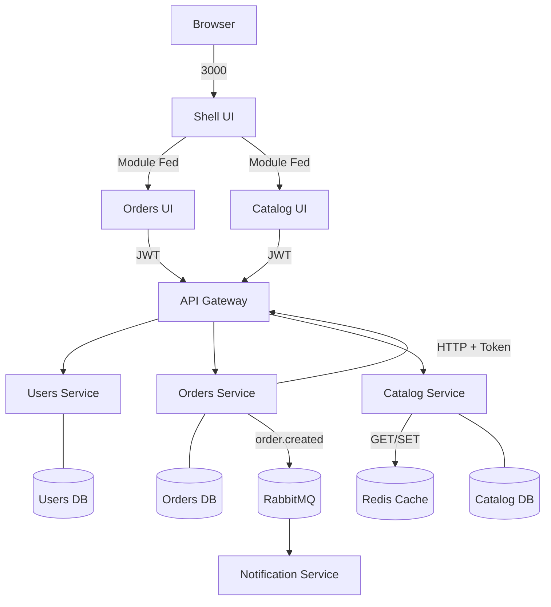

E-Commerce - Plataforma Interna de Gestão de Pedidos

Este repositório contém um PMV de uma plataforma interna para gestão de pedidos em e-commerce.
A implementação usa arquitetura de microsserviços no backend e microfrontends no frontend.

Arquitetura

Backend
- users-service (porta 8001): autenticação e usuários
- orders-service (porta 8002): criação e gestão de pedidos
- catalog-service (porta 8003): produtos e estoque
- api-gateway (porta 8080): ponto único de entrada para o frontend
- notification-service: consumidor de eventos para notificações

Frontend
- shell-ui (porta 3000): host principal
- orders-ui (porta 3001): módulo de pedidos
- catalog-ui (porta 3003): módulo de catálogo

Diagrama de comunicação



Persistência e infraestrutura

- PostgreSQL 15 com bancos lógicos separados por serviço: users_db, orders_db, catalog_db
- Redis para cache de leitura no catálogo
- RabbitMQ para comunicação assíncrona de eventos
- Prometheus e Grafana para métricas e monitoramento
- Docker Compose para subir toda a stack local

Como executar

Pré-requisitos
- Docker e Docker Compose instalados e em execução
- Portas livres: 3000, 3001, 3002, 3003, 5435, 5672, 6379, 8001, 8002, 8003, 8080, 9090 e 15672

Subir a stack

```bash
docker-compose up --build
```

IA gratuita (local com Ollama)

- Instale o Ollama na maquina host: https://ollama.com/download
- Baixe um modelo leve:

```bash
ollama pull llama3.2:3b
```

- O orders-service ja esta configurado por padrao para usar Ollama:
  - AI_PROVIDER=ollama
  - OLLAMA_BASE_URL=http://host.docker.internal:11434
  - OLLAMA_MODEL=llama3.2:3b

- Na interface de pedidos, clique em IA e confirme:
  - Fonte: ollama

Acessos principais
- Aplicação principal: http://localhost:3000
- API Gateway: http://localhost:8080
- Users Service docs: http://localhost:8001/docs
- Orders Service docs: http://localhost:8002/docs
- Catalog Service docs: http://localhost:8003/docs
- Prometheus: http://localhost:9090
- Grafana: http://localhost:3002
- RabbitMQ Management: http://localhost:15672

Fluxo de demonstração sugerido
1. Subir a stack com docker-compose up --build
2. Fazer login na aplicação principal
3. Criar e consultar usuários
4. Criar pedido com itens
5. Filtrar pedidos por status
6. Atualizar status de pedido
7. Abrir Swagger dos serviços
8. Ver métricas no Prometheus e no Grafana
9. Parar um serviço para demonstrar comportamento degradado

Principais endpoints

Usuários
- POST /login
- POST /users/
- GET /users/
- GET /users/{user_id}
- GET /users/by-username/{username}

Pedidos
- POST /orders/
- GET /orders/
- GET /orders/{order_id}
- GET /orders/{order_id}/ai-priority
- PATCH /orders/{order_id}/status

Catálogo
- GET /catalog/
- POST /catalog/
- PATCH /catalog/{product_id}
- PATCH /catalog/{product_id}/stock
- DELETE /catalog/{product_id}

Decisões técnicas

- FastAPI foi adotado para acelerar entrega do PMV com tipagem, validação e OpenAPI automático
- Modelo de pedidos em mestre-detalhe com Order e OrderItem
- Preço unitário persistido no momento da compra para manter histórico financeiro
- Criação de pedido valida usuário, valida estoque/preço, baixa estoque, persiste pedido e publica evento
- Em caso de falha após reserva de estoque, existe tentativa de compensação
- Autenticação com JWT e propagação entre serviços
- Observabilidade com logs estruturados, correlação por X-Correlation-ID e métricas HTTP para Prometheus

Testes e CI

- Testes unitários em users-service, orders-service e catalog-service
- Pipeline em .github/workflows/ci.yml roda testes em push e pull request para main e master

Comandos de teste local

```bash
cd backend/users-service && pytest -v
cd backend/orders-service && pytest -v
cd backend/catalog-service && pytest -v
```

Evoluções com mais tempo

- Remover segredos hardcoded e usar gerenciamento seguro de credenciais
- Refinar políticas de CORS e autorização por recurso
- Migrar de create_all para migrations com Alembic
- Expandir testes de integração, contrato e concorrência
- Fortalecer resiliência com retry e circuit breaker
- Melhorar experiência dos microfrontends
- Expandir camada de IA para incluir resumo de risco e recomendação de SLA por lote

Uso de IA no desenvolvimento

Ferramentas de IA podem ter sido usadas como apoio de produtividade para aceleração de boilerplate, revisão de trechos e apoio de documentação, com revisão manual do resultado final.
