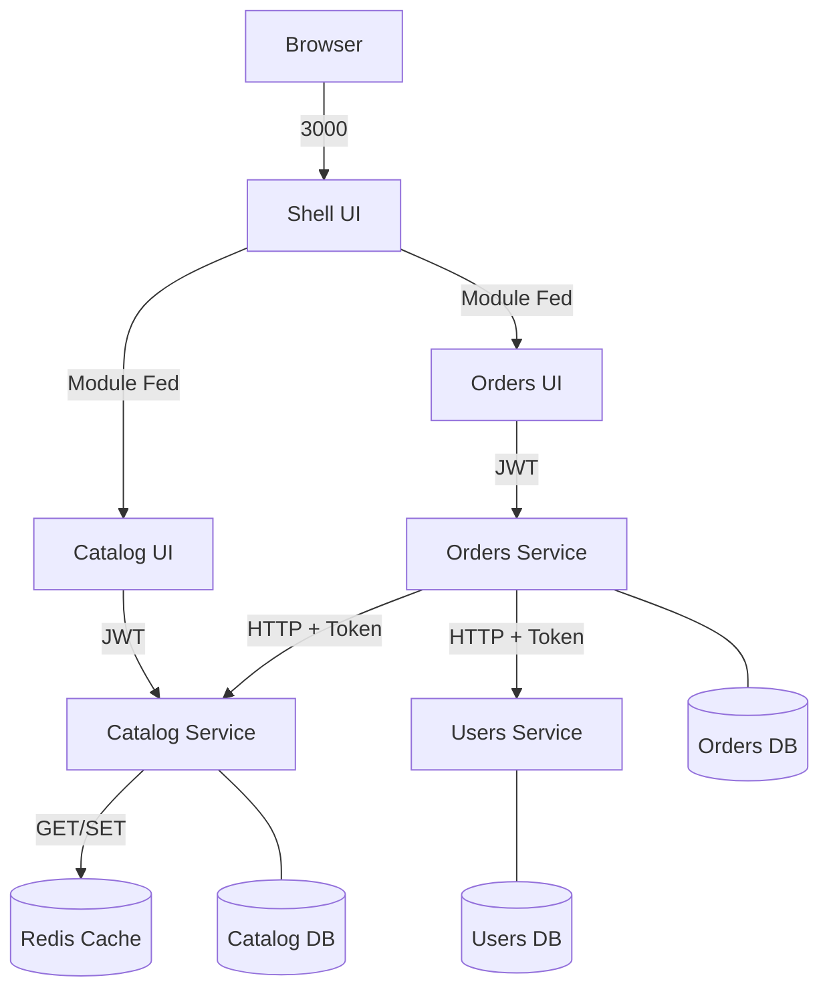

# E-Commerce Gestão de Pedidos (MVP)

Este é um projeto de MVP para a plataforma interna de gestão de pedidos de uma empresa de e-commerce, construído utilizando uma arquitetura de Microsserviços e Microfrontends.

## 🚀 Instruções de Execução

### Pré-requisitos
- Docker e Docker Compose instalados e em execução.
- Git.

### Passos
1. Clone o repositório.
2. Na raiz do projeto, suba toda a stack Docker:
   ```bash
   docker-compose up --build
   ```
3. Acesse a aplicação no seu navegador:
   - **Shell UI (Host Principal)**: [http://localhost:3000](http://localhost:3000)
4. Acesse a documentação nativa das APIs (Swagger):
   - **Users Service**: [http://localhost:8001/docs](http://localhost:8001/docs)
   - **Orders Service**: [http://localhost:8002/docs](http://localhost:8002/docs)
   - **Catalog Service**: [http://localhost:8003/docs](http://localhost:8003/docs)

## 🏗️ Arquitetura Final

O projeto utiliza uma malha de **3 microsserviços** e **3 microfrontends** independentes:

- **Backend (FastAPI)**:
    - **Users Service**: Responsável por autenticação JWT e gestão de usuários.
    - **Catalog Service**: Gere o catálogo de produtos e inventário, utilizando **Redis** para cache de alta performance.
    - **Orders Service**: Orquestra pedidos no modelo **Mestre/Detalhe**, validando estoque síncronamente com o catálogo.
- **Frontend (React/Vite)**: 
    - **Shell (Porta 3000)**: Host que integra os MFEs via Module Federation.
    - **Orders UI (Porta 3001)**: Sistema de carrinho, listagem e busca por ID.
    - **Catalog UI (Porta 3003)**: Gestão de produtos e visibilidade de estoque.
- **Persistência**: PostgreSQL com 3 bancos de dados lógicos isolados (`users_db`, `catalog_db`, `orders_db`).
- **Cache**: Redis (Cache-Aside Pattern) implementado no serviço de Catálogo.

### Diagrama de Comunicação



## 🧠 Decisões Técnicas e Diferenciais

- **Arquitetura Master/Detail**: Essencial para e-commerce, permitindo que um único pedido contenha múltiplos produtos com quantidades variadas.
- **Persistência de Preço Histórico**: O preço unitário do produto é capturado e persistido no `OrderItem` no momento da criação do pedido. Isso garante a integridade financeira mesmo que o preço do produto mude no catálogo futuramente.
- **Controle de Estoque Atômico**: A validação e baixa de estoque ocorrem de forma síncrona durante a criação do pedido. Se o catálogo retornar erro de estoque insuficiente, a transação do pedido é interrompida.
- **Segurança (JWT Propagation)**: Tokens JWT são validados em cada microsserviço e propagados nas chamadas inter-serviços, garantindo que a identidade do usuário seja mantida em toda a cadeia.
- **Estratégia de Cache**: O uso de Redis no Catálogo reduz drasticamente a latência de leitura, com invalidação automática em qualquer operação de escrita (POST/PATCH/DELETE).

## ⏱️ O que ficaria diferente com mais tempo?

- **Mensageria Assíncrona**: Utilização de RabbitMQ ou Kafka para processar notificações e integração com logística após a confirmação do pedido.
- **Observabilidade**: Adição de Prometheus/Grafana para métricas e Jaeger para rastreamento distribuído (tracing).
- **IA Generativa**: Integração com LLMs para sugerir prioridades de despacho ou prever demanda de estoque baseada no histórico.
- **CI/CD**: Expansão do pipeline de CI para deploy automático em ambientes de staging.

