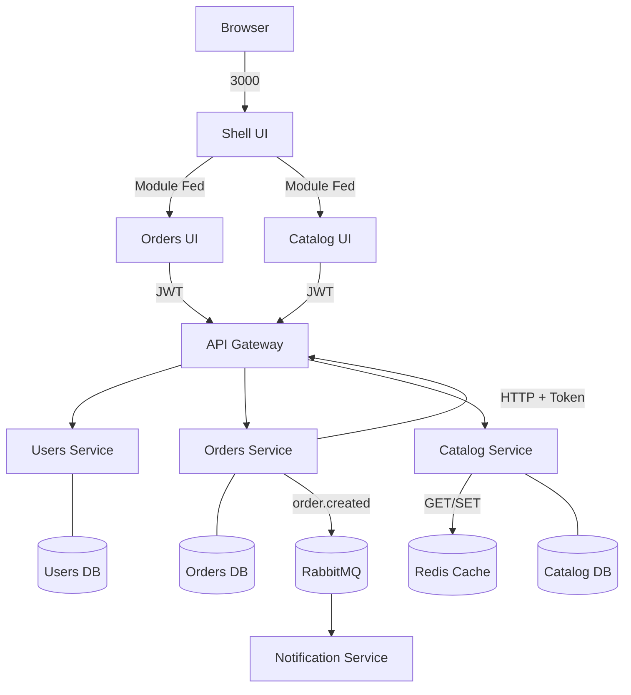

E-Commerce - Plataforma de Gestão de Pedidos

Este repositório contém um PMV de uma plataforma para gestão de pedidos em e-commerce.
A implementação usa arquitetura de microsserviços no backend e microfrontends no frontend.

Arquitetura atual

Backend
- users-service (porta 8001): autenticação e gestão de usuários
- orders-service (porta 8002): criação/listagem de pedidos, atualização de status e sugestão de prioridade por IA
- catalog-service (porta 8003): gestão de produtos e estoque com cache Redis
- api-gateway (porta 8080): ponto único de entrada para o frontend
- notification-service: consumidor de eventos de pedido via RabbitMQ para envio de notificação

Frontend
- shell-ui (porta 3000): host principal (login e navegação)
- orders-ui (porta 3001): gestão de pedidos + ação de IA por pedido
- catalog-ui (porta 3003): gestão de catálogo com filtro por nome ou ID

Diagrama de comunicação



Persistência e infraestrutura

- PostgreSQL com bancos lógicos separados por serviço: users_db, orders_db, catalog_db
- Redis para cache de leitura no catálogo
- RabbitMQ para comunicação assíncrona de eventos
- Prometheus para coleta de métricas
- Grafana para visualização de métricas
- Docker Compose para subir toda a stack local


Decisões técnicas

- FastAPI foi adotado para acelerar entrega do PMV com tipagem, validação de dados e documentação OpenAPI automática.
- O frontend foi dividido por domínio de negócio, com um host (shell-ui) e dois remotos independentes (orders-ui e catalog-ui), compostos por Module Federation no Vite. Essa estratégia foi escolhida para permitir evolução por módulo com menor acoplamento entre áreas e menor risco de regressão cruzada: cada MFE mantém seu próprio ciclo de desenvolvimento/build, enquanto o shell centraliza autenticação, navegação e composição da experiência final. O trade-off é o aumento da complexidade de integração no frontend, mas para o PMV essa escolha equilibra bem autonomia dos módulos com experiência unificada para o usuário.
- O domínio de pedidos usa modelo mestre-detalhe (Order e OrderItem), permitindo múltiplos itens por pedido com rastreabilidade por item.
- A criação de pedido segue fluxo transacional de negócio: valida usuário, valida estoque e preço, baixa estoque, persiste pedido e publica evento.
- Em falhas após baixa de estoque, existe tentativa de compensação (rollback de estoque) para reduzir inconsistência operacional.
- A comunicação entre serviços de negócio passa pelo API Gateway, centralizando entrada do frontend e propagação de headers.
- Autenticação usa JWT com propagação entre serviços e validação local nas rotas protegidas.
- A mensageria é usada para desacoplar a criação do pedido do envio de notificação. Quando o orders-service conclui o pedido, ele publica um evento order.created no RabbitMQ (exchange order.events), e o notification-service consome esse evento pela fila order.notifications para processar o envio do e-mail de confirmação. Com isso, o fluxo principal de checkout não fica bloqueado por uma operação externa mais lenta, e mesmo que a notificação falhe, o pedido permanece salvo corretamente. Esse desenho também facilita evolução futura, porque novos consumidores podem assinar os mesmos eventos sem alterar o serviço de pedidos.
- A integração de IA em pedidos foi desenhada com estratégia de provedores (ollama/openai/heuristic), com fallback automático para heurística quando o provedor falha.
- Para evitar recomendações incoerentes, a camada de IA aplica regras de consistência por status (ex.: ENVIADO/ENTREGUE).
- Observabilidade combina logs estruturados com correlação por Correlation ID e métricas HTTP expostas para Prometheus/Grafana.


Como executar

Pré-requisitos
- Docker e Docker Compose instalados e em execução
- Portas livres: 3000, 3001, 3002, 3003, 5435, 5672, 6379, 8001, 8002, 8003, 8080, 9090 e 15672

Subir a stack

```bash
docker compose up --build
```

Acessos principais
- Aplicação principal: http://localhost:3000
- API Gateway: http://localhost:8080
- Users Service docs: http://localhost:8001/docs
- Orders Service docs: http://localhost:8002/docs
- Catalog Service docs: http://localhost:8003/docs
- Prometheus: http://localhost:9090
- Grafana: http://localhost:3002
- RabbitMQ Management: http://localhost:15672

Integração de IA

No módulo de pedidos, a IA é executada por endpoint dedicado e exibida na tabela com:
- prioridade (ALTA, MEDIA, BAIXA)
- justificativa
- ação recomendada
- fonte (ollama, openai ou heuristic)

Endpoint de IA
- orders-service: GET /orders/{order_id}/ai-priority
- api-gateway: GET /api/orders/{order_id}/ai-priority

Provedores suportados no orders-service
- AI_PROVIDER=ollama (padrão no docker-compose, local)
- AI_PROVIDER=openai
- AI_PROVIDER=heuristic (somente regras locais)

Variáveis de ambiente de IA
- AI_PROVIDER
- OLLAMA_BASE_URL (padrão: http://host.docker.internal:11434)
- OLLAMA_MODEL (padrão: llama3.2:3b)
- OLLAMA_TIMEOUT_SECONDS (padrão interno do serviço: 25)
- OPENAI_API_KEY (quando AI_PROVIDER=openai)
- OPENAI_MODEL (padrão: gpt-4o-mini)
- OPENAI_TIMEOUT_SECONDS (padrão interno do serviço: 12)

Comportamento de fallback
- Se o provedor de IA falhar, exceder timeout ou retornar conteúdo inválido, o serviço retorna sugestão por heurística local.
- Nessa situação, a UI mostra Fonte: heuristic.

Consistência por status do pedido
- Para ENVIADO e ENTREGUE, a recomendação é ajustada para ações coerentes de operação.

Como usar IA local gratuita com Ollama

1. Instale o Ollama no host
- https://ollama.com/download

2. Baixe o modelo padrão usado no projeto

```bash
ollama pull llama3.2:3b
```

3. Suba/recrie os serviços

```bash
docker compose up -d --build orders-service api-gateway
```

4. Na tela de pedidos, clique no botão IA
- Se estiver funcionando com modelo local, aparecerá Fonte: ollama.

Timeout e erros no gateway

- O api-gateway usa GATEWAY_TIMEOUT_SECONDS (padrão: 35 no docker-compose).
- Quando o serviço interno demora acima do limite, o gateway retorna:
  - HTTP 504
  - detail: Gateway timeout: o serviço interno demorou para responder

Principais endpoints

Usuários
- POST /login (users-service)
- POST /api/login (via gateway)
- POST /users/
- GET /users/
- GET /users/{user_id}
- GET /users/by-username/{username}

Pedidos
- POST /orders/
- GET /orders/
- GET /orders/{order_id}
- GET /orders/{order_id}/ai-priority
- PATCH /orders/{order_id}/status

Catálogo
- GET /catalog/
- POST /catalog/
- PATCH /catalog/{product_id}
- PATCH /catalog/{product_id}/stock
- DELETE /catalog/{product_id}

Testes e CI

- Existem testes unitários em users-service, orders-service e catalog-service.
- A pipeline em .github/workflows/ci.yml executa testes de backend em push e pull request para main/master.

Comandos de teste local

```bash
cd backend/users-service && pytest -v
cd backend/orders-service && pytest -v
cd backend/catalog-service && pytest -v
```

